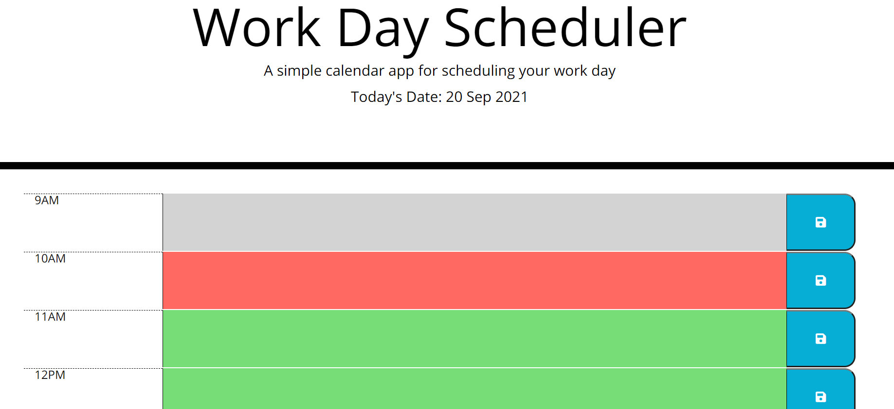
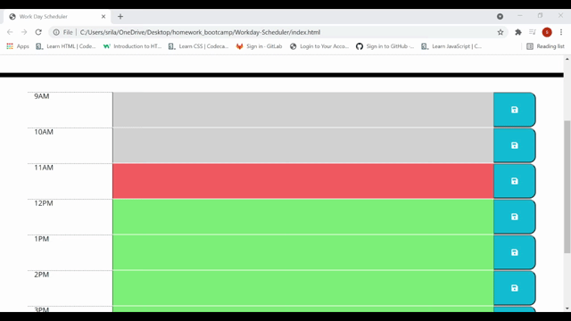

# WORKDAY-SCHEDULER

## INTROUCTION

- Workday-Scheduler is a day planner application.
- This application displays standard business hours where a user can make notes of their to-do tasks and save them.
- The day planner is colour-coded. Red colour indicates the current hour. Green indicates the future hours . Gray indicates the hours that have passed.

## SKILLS

- The application uses knowledge of the following technologies
  ** HTML
  ** CSS
  ** JavaScript
  ** BootStrap
  ** JQuery
  ** Moment.js

## ASSETS

- The following is the appearance of the application 

- The following is the demo of the application 

## CREDITS

- I have used knowledge from the class activities by my instructors, some youtube tutorials and various resources from google to make this application.
